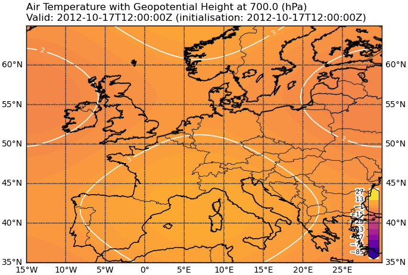

Creating your own plot
----------------------

Sometimes the classes provided by MSS are not enough. This page will show you how our plot classes are structured and how to build your own one.
This is an example of a plot class

.. literalinclude:: ../samples/config/wms/template_plot_style.py

It produces the following plot, filled with a temperature colourmap and geopotential_height contour lines

----

By cutting the code into segments it will be easier to understand what it does and how to change it to your liking.

.. literalinclude:: ../samples/config/wms/template_plot_style.py
   :start-after: import mslib.mswms.mpl_hsec_styles
   :end-before: required_datafields

We begin our plots with various identifiers and information which should be self-explanatory.

----

.. literalinclude:: ../samples/config/wms/template_plot_style.py
   :start-after: abstract
   :end-before: def

Within the **required_datafields** you list all quantities your plot initially needs as a list of 3-tuples containing

1. The type of vertical level (ml, pl, al, pv, tl, sfc)
2. The CF standard name of the entity required
3. The desired unit of the entity

----

.. literalinclude:: ../samples/config/wms/template_plot_style.py
   :start-after: ]
   :end-before: # main plot

First inside the plotting function the desired range of the temperature and height is set.
This is mainly for the colourmaps. The colourmap is linear between the lowest and highest value entered here.
This doesn't necessarily mean it must be the lowest possible temperature.
Second it is decided which entity will fill out the map and which will just be a contour above it. Of course you don't need both, any one will suffice.

----

.. literalinclude:: ../samples/config/wms/template_plot_style.py
   :start-after: contour_entity
   :end-before: # contour

Now the colourmap is decided, in this case "plasma". It is best to pick one which best describes your data.
Here is a `list of all available ones <https://matplotlib.org/stable/tutorials/colors/colormaps.html>`_.
Afterwards the map is filled with the fill_entity and a corresponding colour bar is created.
Of course if you only want a contour plot, you can delete this part of the code.

----

.. literalinclude:: ../samples/config/wms/template_plot_style.py
   :start-after: add_colorbar

Lastly the contour_entity is drawn on top of the map, in white. Feel free to use any other colour.
Of course if you don't want a contour, you can delete this part of the code.

----

That's about it. Feel free to :download:`download this template <../samples/config/wms/template_plot_style.py>`
and play around with it however you like.

If you wish to include this into your WMS server

1. Put the file into your mss_wms_settings.py directory, e.g. **~/mss**
2. Assuming you didn't change the file or class name, append the following lines into your mss_wms_settings.py

.. code-block:: python

   from template_plot_style import HS_Template
   register_horizontal_layers = [] if not register_horizontal_layers else register_horizontal_layers
   register_horizontal_layers.append((HS_Template, [next(iter(data))]))
